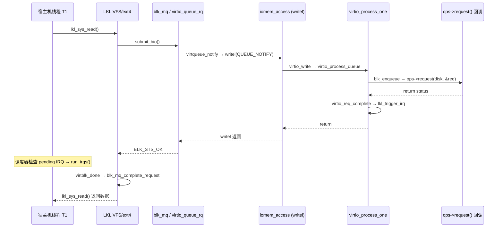
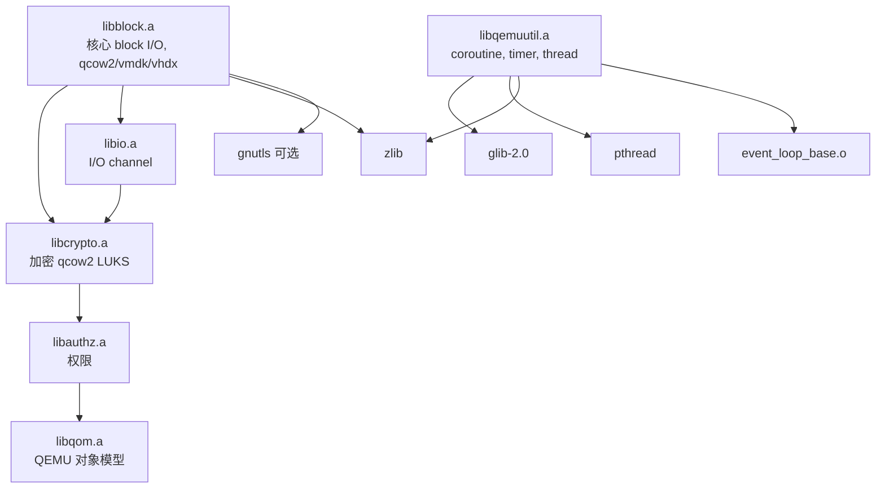
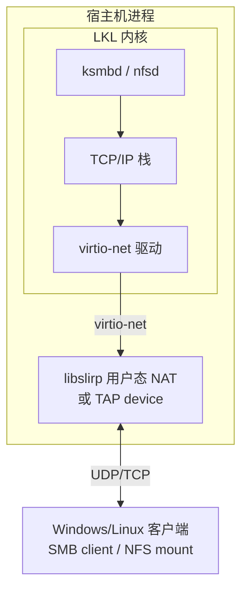
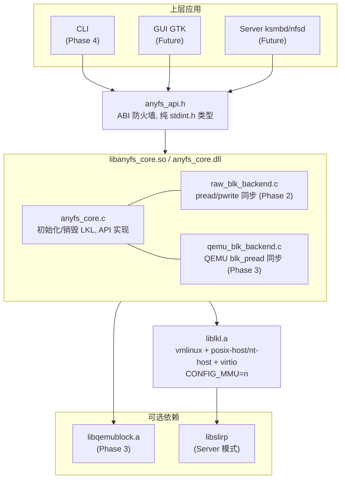

# AnyFS-Reader 详细架构设计 (v2)

## 1. 设计决策总结

| 决策项 | 结论 | 原因 |
|--------|------|------|
| Host Operations | **保持原生 posix-host/nt-host** | 不引入 GLib 替换，降低复杂度 |
| QEMU 集成 | **方案 D: qemu-storage-daemon + NBD** | libblock.a 无法独立链接；子进程方案零侵入 |
| 异步 I/O | **MVP 同步 NBD；可演进到方案 B** | LKL virtio 天然支持异步 IRQ，但同步够用 |
| MMU | **不开启 (CONFIG_MMU=n)** | 文件系统/网络服务器均不需要 MMU |
| ksmbd/nfsd | **可行，NOMMU 模式下支持** | 需开启 FILE_LOCKING + CRYPTO，不依赖 MMU |
| LKL 修改 | **Phase 3 MVP 不改 LKL** | 同步 NBD request() 在 writel 路径中执行，无需异步 |

---

## 2. 调研结论：关键接口摘要

### 2.1 LKL Host Operations (`arch/lkl/include/uapi/asm/host_ops.h`)

```c
struct lkl_host_operations {
    const char *virtio_devices;
    void (*print)(const char *str, int len);
    void (*panic)(void);

    // 信号量 (LKL 调度器核心！用于线程挂起/唤醒)
    struct lkl_sem* (*sem_alloc)(int count);
    void (*sem_free)(struct lkl_sem *sem);
    void (*sem_up)(struct lkl_sem *sem);
    void (*sem_down)(struct lkl_sem *sem);

    // 互斥锁
    struct lkl_mutex *(*mutex_alloc)(int recursive);
    void (*mutex_free/lock/unlock)(...);

    // 线程
    lkl_thread_t (*thread_create)(void (*f)(void *), void *arg);
    void (*thread_detach/exit)(...);
    int (*thread_join)(lkl_thread_t tid);
    lkl_thread_t (*thread_self)(void);
    int (*thread_equal)(lkl_thread_t a, lkl_thread_t b);

    // TLS, 内存, 时钟, 定时器, jmp_buf, ioremap ...
    // (完整定义见 arch/lkl/include/uapi/asm/host_ops.h)
};
```

**平台实现文件**:
- Linux/macOS: `tools/lkl/lib/posix-host.c`
- Windows: `tools/lkl/lib/nt-host.c`
- 共用: `jmp_buf.c` (setjmp/longjmp), `iomem.c` (virtio MMIO)

### 2.2 LKL 块设备接口

```c
struct lkl_disk {
    void *dev;              // 内部 virtio_blk_dev 指针
    union { int fd; void *handle; };
    struct lkl_dev_blk_ops *ops;
};

struct lkl_dev_blk_ops {
    int (*get_capacity)(struct lkl_disk disk, unsigned long long *res);
    int (*request)(struct lkl_disk disk, struct lkl_blk_req *req);
};

struct lkl_blk_req {
    unsigned int type;          // READ=0, WRITE=1, FLUSH=4
    unsigned long long sector;  // 偏移 (单位: 512B)
    struct iovec *buf;
    int count;
};
```

### 2.3 QEMU Block Layer (Phase 3 用)

```c
BlockBackend *blk_new_open(filename, NULL, options, flags, &errp);
int blk_pread(BlockBackend *blk, int64_t offset, int64_t bytes, void *buf, flags);
BlockAIOCB *blk_aio_preadv(blk, offset, qiov, flags, cb, opaque);

// AioContext 是 GSource 子类，可挂载到 GMainLoop
struct AioContext { GSource source; ... };
GSource *aio_get_g_source(AioContext *ctx);
```

---

## 3. Virtio I/O 路径深度分析

### 3.1 完整调用链



### 3.2 关键发现

1. **整个 I/O 链路在同一个宿主机线程中同步完成** — `writel()` 调用
   `iomem_access` → `virtio_process_queue` → `request()` → `virtio_req_complete`
   → `lkl_trigger_irq`，然后返回。IRQ 在同线程的 `lkl_cpu_put` 路径中递送。

2. **LKL 的 IRQ 机制天然支持跨线程** — `lkl_trigger_irq()` 注释明确说
   "can be called from arbitrary host threads"。它用 try-lock + pending 机制。

3. **`struct _virtio_req` 是栈分配的** (在 `virtio_process_one` 中)。
   若要异步必须改为堆分配。

4. **LKL 每个内核任务对应一个宿主机线程** — 通过 `sem_up/sem_down` 做上下文切换
   (见 `__switch_to` in `threads.c`)。多个任务可并行阻塞在各自的 `request()` 中。

### 3.3 对设计的影响

| 场景 | 是否需要异步 | 推荐方案 |
|------|:---:|------|
| CLI (单请求) | ❌ | 同步 pread，零修改 |
| GUI (不能冻 UI) | ⚠️ | 把 LKL 调用放 worker thread，UI 线程不阻塞 |
| Server (多并发) | ⚠️ | LKL 多内核线程并行阻塞 OK；或用异步方案 |
| qcow2 | ⚠️ | 方案 C (线程池 + blk_pread) 或方案 B (patch virtio_blk.c) |

---

## 4. QEMU 集成方案深度分析 (Phase 3)

**策略**: 将 QEMU block layer 及其全部依赖链静态链接进 `libanyfs_core`，
非导出符号全部 `visibility=hidden`。这与 `qemu-img` 的链接方式相同。

### 4.1 QEMU 依赖链 (全部为静态库)



### 4.2 构建策略

```bash
# 1. 配置 QEMU (仅 block tools)
cd ~/qemu && mkdir -p build-anyfs && cd build-anyfs
../configure --disable-system --disable-user \
    --enable-tools --disable-guest-agent \
    --disable-docs --disable-gtk --disable-sdl --disable-opengl \
    --disable-pixman --disable-vnc --disable-spice \
    --target-list=""

# 2. 只编译需要的静态库
ninja libqemuutil.a libqom.a libauthz.a libcrypto.a libio.a libblock.a

# 3. anyfs-reader 链接时:
#    -Wl,--whole-archive libblock.a libcrypto.a ... -Wl,--no-whole-archive
#    -fvisibility=hidden (全局)
#    仅 anyfs_api.h 中的符号标 ANYFS_API (visibility=default)
```

在 Meson 中:
```meson
# 提取 QEMU 构建产物
qemu_build_dir = '<QEMU_BUILD_DIR>'
qemu_libs = [
    qemu_build_dir / 'libblock.a',
    qemu_build_dir / 'libcrypto.a',
    qemu_build_dir / 'libio.a',
    qemu_build_dir / 'libauthz.a',
    qemu_build_dir / 'libqom.a',
    qemu_build_dir / 'libqemuutil.a',
    qemu_build_dir / 'libevent-loop-base.a',
]
qemu_dep = declare_dependency(
    link_args: ['-Wl,--whole-archive'] + qemu_libs + ['-Wl,--no-whole-archive'],
    include_directories: include_directories('<QEMU_SRC>/include'),
    dependencies: [glib_dep, zlib_dep, threads_dep],
)
```

### 4.3 符号隔离

```c
// 编译 libanyfs_core 时: -fvisibility=hidden
// 仅 anyfs_api.h 中声明的函数标记为 visible:
#define ANYFS_API __attribute__((visibility("default")))

// QEMU 内部所有符号 (数千个) 自动 hidden，不污染链接命名空间
```

Windows 上等价方案: `.def` 文件 + `__declspec(dllexport)` 仅导出 anyfs_* 符号。

### 4.4 在 request() 中使用 QEMU 同步 API

```c
// qemu_blk_backend.c
#include "system/block-backend.h"

struct qemu_blk_ctx {
    BlockBackend *blk;
    uint64_t capacity;
};

static int qemu_get_capacity(struct lkl_disk disk, unsigned long long *res) {
    struct qemu_blk_ctx *ctx = disk.handle;
    *res = ctx->capacity;
    return 0;
}

static int qemu_request(struct lkl_disk disk, struct lkl_blk_req *req) {
    struct qemu_blk_ctx *ctx = disk.handle;
    int64_t offset = (int64_t)req->sector * 512;

    for (int i = 0; i < req->count; i++) {
        int ret;
        switch (req->type) {
        case LKL_DEV_BLK_TYPE_READ:
            ret = blk_pread(ctx->blk, offset, req->buf[i].iov_len,
                           req->buf[i].iov_base, 0);
            break;
        case LKL_DEV_BLK_TYPE_WRITE:
            ret = blk_pwrite(ctx->blk, offset, req->buf[i].iov_len,
                            req->buf[i].iov_base, 0);
            break;
        case LKL_DEV_BLK_TYPE_FLUSH:
            ret = blk_flush(ctx->blk);
            break;
        }
        if (ret < 0) return LKL_DEV_BLK_STATUS_IOERR;
        offset += req->buf[i].iov_len;
    }
    return LKL_DEV_BLK_STATUS_OK;
}
```

**注意**: `blk_pread` 内部使用 QEMU 协程 (coroutine)。它在当前线程上下文中
yield/resume，对调用者表现为阻塞调用。由于 LKL 每个内核任务有独立宿主机线程，
多个并发读可以各自阻塞在自己的 `blk_pread` 中而互不干扰。

### 4.5 QEMU 初始化最小序列

```c
int anyfs_qemu_init(const char *image_path, struct qemu_blk_ctx **ctx_out) {
    Error *errp = NULL;

    // QEMU 需要的最小初始化
    bdrv_init();  // 注册所有 block drivers
    qemu_init_main_loop(&errp);  // 初始化 AioContext

    // 打开镜像 (自动检测格式)
    BlockBackend *blk = blk_new_open(image_path, NULL, NULL,
                                      BDRV_O_RDONLY | BDRV_O_NO_FLUSH,
                                      &errp);
    if (!blk) return -1;

    struct qemu_blk_ctx *ctx = calloc(1, sizeof(*ctx));
    ctx->blk = blk;
    ctx->capacity = blk_getlength(blk);
    *ctx_out = ctx;
    return 0;
}
```

### 4.6 方案对比 (最终)

| 方案 | 描述 | 性能 | 复杂度 | LKL 修改 |
|------|------|:---:|:---:|:---:|
| A: 同步 pread | raw img only | ★★★ | 最低 | 无 |
| B: patch LKL + 真异步 | async blk_aio_preadv | ★★★★ | 高 | 需 patch |
| **D: 直接链接 QEMU + 同步** | blk_pread in request() | ★★★ | 中等 | **无** |

**推荐方案 D**: 直接链接 QEMU block layer，在 `request()` 中使用 `blk_pread` 同步调用。
`visibility=hidden` 隔离符号。性能等同于 qemu-img 的读取速度。

---

## 5. MMU 支持分析

| 特性 | 无 MMU (默认, CONFIG_MMU=n) | 有 MMU (CONFIG_MMU=y) |
|------|------|------|
| 内存模型 | flat，一次性 `mem_alloc` 整块 | 真页表，需 `shmem_init` + `shmem_mmap` |
| vmalloc | 不可用 (fallback to kmalloc) | 可用 |
| host_ops 要求 | `mem_alloc` 即可 | + `shmem_init/mmap`, `mmap/munmap` |
| VFS/ext4/xfs/btrfs | ✅ 正常工作 | ✅ |
| ksmbd/nfsd | ✅ 不依赖 MMU | ✅ |
| 网络栈 | ✅ | ✅ |
| FILE_LOCKING | ✅ 不依赖 MMU | ✅ |
| splice (NFS 高效传输) | ✅ 不依赖 MMU | ✅ |
| Windows 移植 | ✅ 简单 | ⚠️ 需 MapViewOfFileEx |

**结论**: AnyFS-Reader 所有功能（文件系统读取 + ksmbd/nfsd Server 模式）均不需要 MMU。

---

## 6. ksmbd/nfsd 可行性分析

### 6.1 依赖检查

| 依赖项 | ksmbd | nfsd | LKL defconfig 状态 | 需修改 |
|--------|:---:|:---:|:---:|:---:|
| INET | ✅ | ✅ | ✅ 已开启 | — |
| MULTIUSER | ✅ | ✅ | ✅ 默认 y | — |
| FILE_LOCKING | ✅ | ✅ | ❌ 关闭 | 需开启 |
| FSNOTIFY | — | ✅ | ❌ 未开启 | 需开启 |
| CRYPTO_* | ✅ | — | ⚠️ 部分 | 需补全 |
| NET_NS | — | — | ✅ | — |
| MMU | ❌ 不需 | ❌ 不需 | ❌ 关闭 | — |

### 6.2 网络栈接入



---

## 7. 修正后的整体架构



---

## 8. ABI 防火墙接口 (`anyfs_api.h`)

```c
#ifndef ANYFS_API_H
#define ANYFS_API_H

#include <stdint.h>
#include <stddef.h>  /* intptr_t, uintptr_t available if needed */

#ifdef _WIN32
  #ifdef ANYFS_CORE_BUILDING
    #define ANYFS_API __declspec(dllexport)
  #else
    #define ANYFS_API __declspec(dllimport)
  #endif
  #define ANYFS_CALL __cdecl
#else
  #define ANYFS_API __attribute__((visibility("default")))
  #define ANYFS_CALL
#endif

/* 不透明句柄 */
typedef struct AnyfsContext AnyfsContext;
typedef struct AnyfsMount  AnyfsMount;
typedef struct AnyfsDir    AnyfsDir;
typedef int64_t            anyfs_fd_t;

/* 初始化/销毁 */
ANYFS_API int32_t ANYFS_CALL anyfs_init(AnyfsContext **ctx_out);
ANYFS_API void    ANYFS_CALL anyfs_destroy(AnyfsContext *ctx);

/* 镜像操作 */
#define ANYFS_OPEN_READONLY  1
ANYFS_API int32_t ANYFS_CALL anyfs_open_image(
    AnyfsContext *ctx, const char *image_path, uint32_t flags);

ANYFS_API int32_t ANYFS_CALL anyfs_mount(
    AnyfsContext *ctx, const char *fs_type, uint32_t part_index,
    AnyfsMount **mount_out);

ANYFS_API int32_t ANYFS_CALL anyfs_umount(AnyfsMount *mnt);

/* 文件操作 */
ANYFS_API anyfs_fd_t ANYFS_CALL anyfs_open(
    AnyfsMount *mnt, const char *path, uint32_t flags);
ANYFS_API int64_t ANYFS_CALL anyfs_read(
    AnyfsMount *mnt, anyfs_fd_t fd, void *buf, uint64_t count);
ANYFS_API int32_t ANYFS_CALL anyfs_close(AnyfsMount *mnt, anyfs_fd_t fd);

/* 目录操作 */
typedef struct {
    uint8_t  type;          /* DT_REG=8, DT_DIR=4, DT_LNK=10 ... */
    uint64_t inode;
    uint64_t size;
    char     name[256];     /* UTF-8, NUL-terminated */
} AnyfsEntry;

ANYFS_API AnyfsDir* ANYFS_CALL anyfs_opendir(AnyfsMount *mnt, const char *path);
ANYFS_API int32_t   ANYFS_CALL anyfs_readdir(AnyfsDir *dir, AnyfsEntry *entry_out);
ANYFS_API int32_t   ANYFS_CALL anyfs_closedir(AnyfsDir *dir);

/* 错误码 */
#define ANYFS_OK             0
#define ANYFS_ERR_NOMEM     (-1)
#define ANYFS_ERR_IO        (-2)
#define ANYFS_ERR_INVAL     (-3)
#define ANYFS_ERR_NOENT     (-4)
#define ANYFS_ERR_NOTDIR    (-5)
#define ANYFS_ERR_BUSY      (-6)
#define ANYFS_ERR_NOSYS     (-7)
#define ANYFS_ERR_FORMAT    (-8)

#endif /* ANYFS_API_H */
```

**ABI 规则**:
- 固定宽度整数: `int32_t`, `int64_t`, `uint32_t`, `uint64_t`
- 指针宽度整数: `intptr_t`, `uintptr_t` (用于 handle/opaque 场景)
- 绝无 `long`, `size_t`, `ssize_t` (这些类型在 Win32 LLP64 vs Linux LP64 下宽度不同)
- 结构体内使用固定长度数组 (避免跨 ABI 指针问题)
- Windows 导出: `__cdecl` 调用约定

---

## 9. 文件结构

```
anyfs-reader/
├── meson.build
├── meson_options.txt
├── ARCHITECTURE.md              # 本文件
│
├── include/
│   └── anyfs_api.h              # 公开 ABI 接口
│
├── src/
│   ├── core/
│   │   ├── meson.build
│   │   ├── anyfs_core.c         # API 实现 (封装 LKL 调用)
│   │   ├── raw_blk_backend.c    # pread/pwrite 同步后端 (.img)
│   │   ├── raw_blk_backend.h
│   │   ├── nbd_blk_backend.c    # NBD client 后端 (qcow2 via qemu-storage-daemon)
│   │   └── nbd_blk_backend.h
│   │
│   └── cli/
│       ├── meson.build
│       └── main.c               # CLI shell (Phase 4)
│
└── tests/
    ├── test_raw_mount.c         # raw img 挂载验证
    └── test_qcow2_mount.c      # qcow2 via NBD 验证
```

---

## 10. 实施路线图

### PoC 阶段 (已完成 ✅ — lklftpd/test_disk.c)
- LKL 6.12 (PR #625) 编译成功，liblkl.a 可用
- 同步 RAW 后端验证通过 (pread + `lkl_disk_add` + `lkl_mount_dev`)
- Windows 交叉编译 (i686-w64-mingw32) 验证通过
- binutils 弱符号 bug 已修复 (coff_nt_weak_to_local patch)

### Phase 2: anyfs API + RAW 后端 (已完成 ✅)
- `anyfs_api.h` ABI 安全接口定义
- `anyfs_core.c` 封装 LKL 调用
- `raw_blk_backend.c` 同步 pread 后端
- 测试覆盖: ext4, xfs, btrfs, vfat × 整盘 + GPT 混合分区 (8/8 pass)

### Phase 2a: GIO 同步后端 (已完成 ✅)
- `gio_blk_backend.c`: GFileInputStream + GSeekable (seek+read)
- 跨平台验证: 与 raw 后端输出完全一致 (8/8 pass)
- GLib 从源码 (`~/glib`) 静态编译 (`build-static/`)

### Phase 2b: GIO 异步后端 (已完成 ✅)
- `gio_async_blk_backend.c`: 独立 I/O 线程 GMainLoop + 跨线程分发
- 架构: LKL 线程 → g_idle_source → I/O 线程 → g_input_stream_read_async → 回调 → g_cond_signal
- 验证: 所有 FS/分区组合通过 (8/8 pass)
- **证明**: GMainLoop 异步桥接模式可行，为 Phase 3 QEMU AioContext 做铺垫

### Phase 2c: 性能基准测试 (已完成 ✅)

**大文件 (128MB, 超过 LKL 64MB page cache → 真实后端 I/O)**:
```
  Backend      | Init      | Mount    | 10000 reads (4KB seq)  | per-op
  raw          |  82.72 ms |  1.17 ms |  285.92 ms             |  29 µs
  gio-sync     |  78.83 ms |  1.60 ms |  343.46 ms             |  34 µs
  gio-async    |  80.55 ms |  5.16 ms |  439.61 ms             |  44 µs
```

**小文件 (page cache 命中 → VFS 路径开销)**:
```
  Backend      | Init      | Mount    | 10000 open+read+close  | per-op
  raw          |  59.20 ms |  1.48 ms |  476.75 ms             |  48 µs
  gio-sync     |  59.06 ms |  1.24 ms |  141.81 ms             |  14 µs (*)
  gio-async    |  79.64 ms |  3.46 ms |  995.75 ms             | 100 µs
```

(*) GIO sync 异常快 — 可能有 GFileInputStream 内部 readahead buffer。

**结论**:
- 异步桥接开销: +15µs/op (29→44µs)，对 HDD/网络存储可忽略，对 NVMe 约 +30%
- LKL 启动时间: ~60-90ms (内核 boot)，挂载: ~1-5ms
- Phase 3 推荐同步方案 D (blk_pread)，零额外开销

### Phase 3: QEMU 块后端 (下一步)

**方案 D (直接链接)**: 静态链接 QEMU block layer，`blk_pread()` 在 `request()` 中同步调用。
QEMU 静态库已构建完成 (`~/qemu/build-anyfs/lib*.a`)。

**方案 B (真异步，见下方 §13 分析)**: patch LKL virtio_blk.c，`request()` 返回 PENDING。

### Phase 4: CLI Shell
- readline 集成
- 命令: `open`, `mount`, `ls`, `cat`, `stat`, `exit`

### Phase 5: Server 模式 (Future)
- 修改 LKL defconfig: 开启 `FILE_LOCKING`, `FSNOTIFY`, `CRYPTO_*`
- 接入 virtio-net + libslirp
- 启动 ksmbd/nfsd 内核模块

---

## 11. 风险与注意事项

| 风险 | 缓解 |
|------|------|
| QEMU 链接符号冲突 | `-fvisibility=hidden` + 仅导出 anyfs_* |
| Windows 上 LKL 的 `long` 是 64 位 | LKL 必须用 MinGW64 编译 (LP64 ABI)，通过 DLL 隔离 |
| `virtio_process_one` 栈上 `_req` | 同步方案中 request 返回前 _req 有效，无问题 |
| LKL 只能初始化一次 | 进程生命周期内单例；benchmark 用 fork 隔离 |
| LKL defconfig 未开 FILE_LOCKING | Phase 5 (Server) 时需修改并重编译 |
| MinGW 弱符号 bug | 已通过 binutils patch 解决 (见 lklftpd/docs/lkl-win32.md) |

---

## 12. 已有成果

| 阶段 | 文件 | 验证内容 | 状态 |
|------|------|----------|:----:|
| PoC | `lklftpd/test_disk.c` | raw mount, readdir | ✅ |
| Phase 2 | `src/core/raw_blk_backend.c` | pread 后端 | ✅ |
| Phase 2 | `src/core/anyfs_core.c` | API 实现 | ✅ |
| Phase 2a | `src/core/gio_blk_backend.c` | GIO 同步后端 | ✅ |
| Phase 2b | `src/core/gio_async_blk_backend.c` | GIO 异步后端 | ✅ |
| Phase 2c | `tests/bench_backends.c` | 性能对比基准 | ✅ |
| Phase 2 | `tests/run_tests.sh` | 集成测试 (24/24 pass) | ✅ |
| Build | `~/linux/tools/lkl/liblkl.a` | LKL 原生构建 (336MB) | ✅ |
| Build | `~/glib/build-static/` | GLib 静态库 | ✅ |
| Build | `~/qemu/build-anyfs/lib*.a` | QEMU block 静态库 | ✅ |

---

## 13. 真异步 Virtio-Blk 改造方案 (方案 B 详细设计)

### 13.1 目标

让 LKL 的 `request()` 回调可以异步返回 (PENDING)，I/O 完成后从**任意宿主机线程**
调用 `virtio_req_complete()` + `lkl_trigger_irq()` 唤醒内核。

### 13.2 需要修改的代码 (3 处，共约 40 行)

#### 修改 1: `tools/lkl/lib/virtio.c` — `_req` 改为堆分配

```c
// 现状: 栈分配 (request 返回后 _req 失效)
static int virtio_process_one(struct virtio_dev *dev, int qidx)
{
    struct _virtio_req _req = { .dev = dev, .q = q, .idx = idx };  // ← 栈上!
    ...
    return dev->ops->enqueue(dev, qidx, &_req.req);
}

// 改为: 堆分配 (异步完成前 _req 保持有效)
static int virtio_process_one(struct virtio_dev *dev, int qidx)
{
    struct _virtio_req *_req = lkl_host_ops.mem_alloc(sizeof(*_req));
    if (!_req) return -LKL_ENOMEM;
    _req->dev = dev;
    _req->q = q;
    _req->idx = idx;
    struct virtio_req *req = &_req->req;
    ...
    int ret = dev->ops->enqueue(dev, qidx, req);
    if (ret != -LKL_EINPROGRESS)   // ← 新: 同步完成则立即释放
        lkl_host_ops.mem_free(_req);
    return ret;
}
```

#### 修改 2: `tools/lkl/lib/virtio_blk.c` — 支持 PENDING 状态

```c
// 新增常量
#define LKL_DEV_BLK_STATUS_PENDING  255

static int blk_enqueue(struct virtio_dev *dev, int q, struct virtio_req *req)
{
    ...
    t->status = blk_dev->ops->request(blk_dev->disk, &lkl_req);

    if (t->status == LKL_DEV_BLK_STATUS_PENDING) {
        // 异步: request() 保存了 req 指针，稍后自行调用 virtio_req_complete
        return -LKL_EINPROGRESS;  // 告诉 virtio_process_one 不要释放 _req
    }

out:
    virtio_req_complete(req, 0);
    return 0;
}
```

#### 修改 3: `virtio_req_complete()` — 异步路径释放 `_req`

```c
void virtio_req_complete(struct virtio_req *req, uint32_t len)
{
    struct _virtio_req *_req = container_of(req, struct _virtio_req, req);
    ...
    // 现有的 IRQ 递送逻辑不变
    if (send_irq || lkl_vring_need_event(...)) {
        q->last_used_idx_signaled = virtio_get_used_idx(q);
        virtio_deliver_irq(_req->dev);
    }

    // 新增: 异步路径负责释放 _req
    lkl_host_ops.mem_free(_req);  // ← 新增
}
```

### 13.3 线程安全性分析

| 函数 | 是否线程安全 | 说明 |
|------|:---:|------|
| `virtio_req_complete()` | ✅ | 操作的都是局部 idx + atomic 写 used ring |
| `lkl_trigger_irq()` | ✅ | 注释明确说 "can be called from arbitrary host threads" |
| `virtio_deliver_irq()` | ✅ | 只做 atomic store + trigger_irq |
| `virtio_process_queue()` | ⚠️ 需锁 | blk 设备不用 acquire_queue，但异步完成可能并发 |

**潜在竞争**: 如果多个异步请求同时完成，它们的 `virtio_req_complete()` 可能并发
修改同一个 `q->used` ring。需要在 `virtio_req_complete()` 入口加互斥锁：

```c
void virtio_req_complete(struct virtio_req *req, uint32_t len)
{
    struct _virtio_req *_req = container_of(req, struct _virtio_req, req);
    struct virtio_queue *q = _req->q;

    lkl_host_ops.mutex_lock(q->completion_lock);  // ← 新增: 保护 used ring
    // ... 现有逻辑 ...
    lkl_host_ops.mutex_unlock(q->completion_lock);
    lkl_host_ops.mem_free(_req);
}
```

### 13.4 异步后端使用方式

```c
// 在异步后端的 request() 中:
struct async_io_ctx {
    struct virtio_req *vreq;  // 保存 virtio request 指针
    struct lkl_blk_req req;
    // ... I/O 相关数据 ...
};

static int async_request(struct lkl_disk disk, struct lkl_blk_req *req)
{
    struct async_io_ctx *io = malloc(sizeof(*io));
    io->vreq = /* 需要从 blk_enqueue 传入 */;
    memcpy(&io->req, req, sizeof(*req));

    // 提交异步 I/O (例: QEMU blk_aio_preadv, 或 io_uring)
    submit_async_io(io);

    return LKL_DEV_BLK_STATUS_PENDING;
}

// I/O 完成回调 (从 I/O 线程调用):
void io_complete_cb(struct async_io_ctx *io, int status)
{
    struct virtio_blk_req_trailer *t = /* ... */;
    t->status = status;
    virtio_req_complete(io->vreq, 0);  // 唤醒 LKL
    free(io);
}
```

### 13.5 接口问题

当前 `blk_dev->ops->request()` 无法传递 `struct virtio_req *` 给回调端。
需要扩展 `struct lkl_blk_req` 或 `struct lkl_dev_blk_ops`:

```c
struct lkl_blk_req {
    unsigned int type;
    unsigned int prio;
    unsigned long long sector;
    struct iovec *buf;
    int count;
    void *opaque;  // ← 新增: 用于异步完成时回传
};

// 或者新增 ops:
struct lkl_dev_blk_ops {
    int (*get_capacity)(struct lkl_disk disk, unsigned long long *res);
    int (*request)(struct lkl_disk disk, struct lkl_blk_req *req);
    void (*complete)(struct lkl_disk disk, struct lkl_blk_req *req);  // ← 新增
};
```

### 13.6 方案 B vs 方案 D 最终对比

| | 方案 B (patch LKL, 真异步) | 方案 D (同步 blk_pread) |
|---|---|---|
| **LKL 修改** | ~40 行 (3 个文件) | 0 行 |
| **性能** | 最优 (零阻塞) | 与 raw pread 相同 |
| **并发** | 多个 I/O 可并行 flight | 多个 LKL 线程各自阻塞 |
| **复杂度** | 中等 (需管理内存+锁) | 最低 |
| **真实场景价值** | NVMe SSD + 高并发 | 大多数场景够用 |

**建议**: Phase 3 先用方案 D (零修改，快速交付)。Phase 5 Server 模式（高并发 NFS/SMB 服务）时再实施方案 B。

---

## 14. 已实现：Threadless AIO 后端 (2026-05)

### 14.1 架构

```
宿主机进程 (单线程，无 pthread)
├── LKL 内核 (单 vCPU)
│   └── virtio_blk → ops->request() → io_submit()
└── posix_idle 事件循环
    ├── pipe fd (sem_up 通知)
    ├── timer fd (定时器)
    └── eventfd (AIO 完成通知) ← io_getevents → lkl_disk_complete_req
```

### 14.2 关键修改

**LKL 侧 (`linux/tools/lkl/`):**
- `lib/posix-host.c`: posix_idle 改为 for(;;) 事件循环 + `idle_add_event`/`idle_del_event` API
- `lib/virtio_blk.c`: 导出 `lkl_disk_complete_req()` 供外部 AIO 后端调用
- `include/lkl_host.h`: `lkl_host_operations` 新增 `idle_add_event`/`idle_del_event`

**anyfs-reader 侧:**
- `src/core/aio_blk_backend.c`: 用 Linux AIO (io_setup/io_submit/io_getevents) + eventfd，无线程

### 14.3 I/O 完成路径

1. `virtio_queue_rq` → `ops->request()` → `io_submit()` (非阻塞)
2. 内核线程 `schedule()` → idle task 获得 CPU
3. `posix_idle()` poll eventfd → 有事件
4. `aio_idle_handler()`: `io_getevents()` 收割完成 → `lkl_disk_complete_req(req, 0)`
5. 内核唤醒等待 I/O 的任务 → `sem_up(idle_sem)` → posix_idle 退出循环

### 14.4 已知限制

- **O_DIRECT 必需**: Linux AIO 对 buffered I/O 退化为同步。O_DIRECT 绕过 host page cache，导致 mount 阶段比 raw 后端慢 ~6x（无 readahead）
- **单 vCPU 串行**: 多个 `lkl_sys_read` 无法并行，AIO 优势仅在内核内部多 bio in-flight 时体现
- **bench_raw_io AIO 模式挂起**: partition scan 阶段的 I/O 完成无法 reap（待修复）
- **适用场景**: ksmbd/NFS server 多客户端并发请求时，readahead + 批量 I/O 可受益

### 14.5 性能数据 (raw 后端, /dev/sda 200GB SSD)

| Test | Block | Throughput | IOPS |
|------|-------|-----------|------|
| Sequential Read | 4KB | 70.19 MB/s | 17970 |
| Random Read | 4KB | 24.92 MB/s | 6380 |
