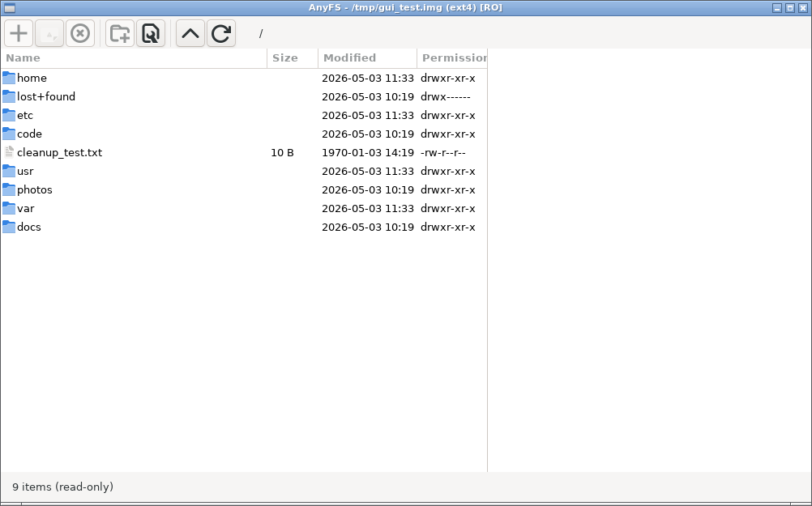
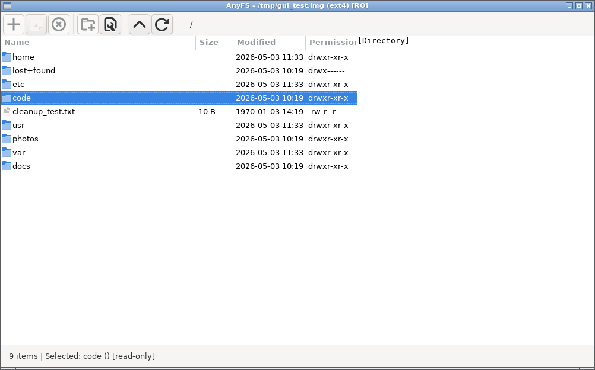
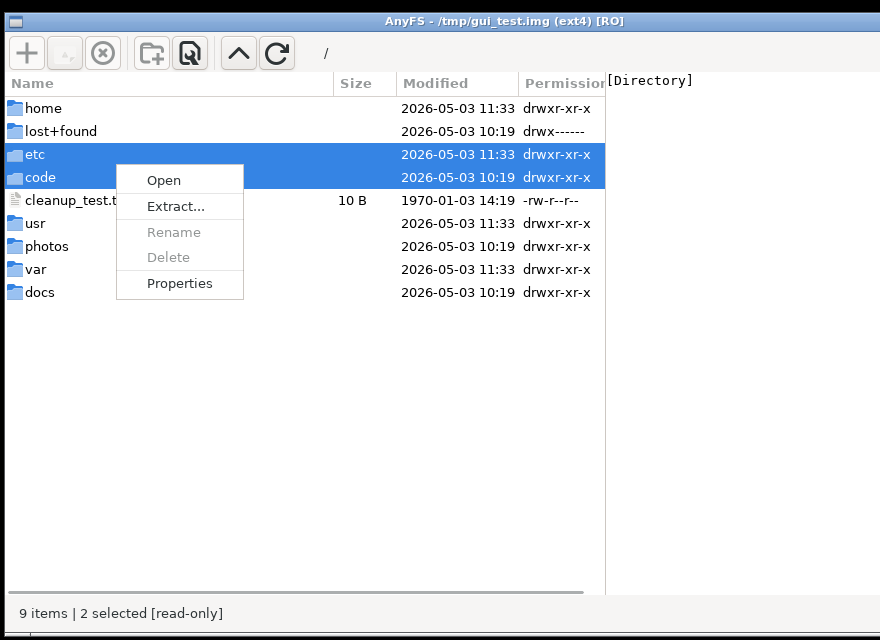
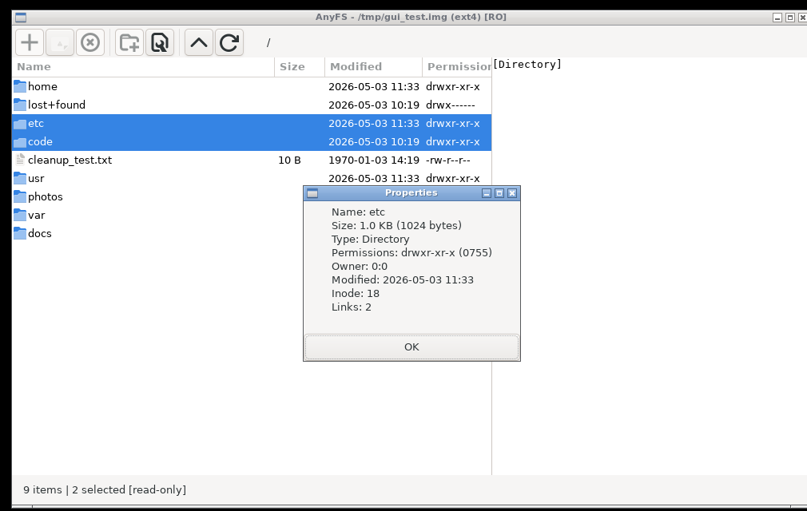

# AnyFS GUI — GTK3 文件管理器

## 概述

`anyfs-gui` 是一个基于 GTK3 的图形文件浏览器，用于查看和操作磁盘镜像中的文件系统。底层使用 LKL 内核直接访问文件系统，无需 root 权限、FUSE 或内核模块。

源码: `src/gui/anyfs_gui.c` (~1600 行)

---

## 截图

### 主窗口 — 根目录列表



文件列表视图显示图标、文件名、大小、修改时间和权限。工具栏提供添加/删除/提取/属性/上级/刷新等操作。状态栏显示项目数和挂载模式 (read-only/read-write)。

### 选中文件 + 预览面板



选中目录时右侧显示 `[Directory]`；选中文本文件时显示前 64KB 内容；选中图片时显示缩略图。

### 右键上下文菜单



右键点击弹出上下文菜单：Open / Extract... / Rename / Delete / Properties。只读模式下 Rename 和 Delete 灰显不可用。注意右侧预览面板显示文本文件内容 ("test data")。

### 属性对话框



显示文件元数据：名称、大小、类型、权限 (数字+字符串)、所有者、修改时间、inode 号、硬链接数。

---

## 功能

| 功能 | 说明 |
|------|------|
| 目录浏览 | 列表视图 + 列排序 (名称/大小/修改时间) |
| 面包屑导航 | 可点击的路径段 + 可编辑路径栏 |
| 文件预览 | 文本文件: 前 64KB 内容; 图片: 缩略图 |
| 拖拽导出 (guest→host) | 从列表拖出文件到宿主文件管理器 |
| 拖拽导入 (host→guest) | 从宿主拖入文件到当前目录 (需 `-w`) |
| 文件提取 (Extract) | 选择文件/目录 → 导出到宿主文件系统 (递归) |
| 添加文件 (Add) | 从宿主选择文件上传到当前目录 (需 `-w`) |
| 删除 (Delete) | 删除选中的文件/目录 (需 `-w`) |
| 新建文件夹 | 在当前目录创建子目录 (需 `-w`) |
| 重命名 | 选中项重命名 (需 `-w`) |
| 属性对话框 | 显示 inode、大小、mode、uid/gid、时间戳 |
| 分区选择 | 多分区镜像弹出分区选择对话框 |
| 键盘快捷键 | Backspace=返回, F5=刷新, F2=重命名, Delete=删除 |
| 右键菜单 | 打开/提取/重命名/删除/属性 |

---

## 使用方法

```bash
# 基本用法 (只读)
./anyfs-gui disk.img

# 读写模式
./anyfs-gui -w disk.img

# 指定分区号 (0=整盘, 1=第一个分区, ...)
./anyfs-gui -p 2 disk.img

# QEMU 格式 (qcow2/vmdk/vdi/vhd 自动检测)
./anyfs-gui disk.qcow2
```

### 命令行选项

| 选项 | 说明 |
|------|------|
| `-w` | 以读写方式挂载 (默认只读) |
| `-p N` | 使用第 N 个分区 (0=整盘; 默认自动检测) |
| `<disk.img>` | 磁盘镜像路径 |

---

## 构建要求

- GTK3 (`gtk+-3.0` pkg-config)
- 已构建的 LKL (`liblkl.a`)
- 可选: QEMU block 后端 (支持 qcow2/vmdk)

```bash
# 检查 GTK3 是否可用
pkg-config --exists gtk+-3.0 && echo "OK"

# 标准构建 (anyfs-gui 在 GTK3 可用时自动启用)
meson setup builddir -Dlkl_root=$HOME/linux/tools/lkl
ninja -C builddir anyfs-gui

# 或在 ksmbd 构建目录中
ninja -C builddir-ksmbd anyfs-gui
```

> **注意**: GUI 使用系统动态 GLib (来自 GTK3)，不使用静态 GLib 的 GIO 后端。
> 这避免了静态/动态 GLib 符号冲突。

---

## 架构

```
┌────────────────────────────────────────────┐
│ GTK3 UI (GtkTreeView + GtkListStore)       │
│ ├─ 面包屑导航 (GtkBox + GtkButton)         │
│ ├─ 文件列表 (可排序列)                      │
│ └─ 预览面板 (GtkStack: text/image)         │
├────────────────────────────────────────────┤
│ LKL syscall 层                             │
│ lkl_sys_open, lkl_sys_getdents64,          │
│ lkl_sys_read, lkl_sys_lstat, ...           │
├────────────────────────────────────────────┤
│ anyfs_core (内核管理 + 后端选择)            │
├────────────────────────────────────────────┤
│ liblkl.a (VFS + ext4/xfs/btrfs/...)       │
└────────────────────────────────────────────┘
```

### UI 列

| 列 | 内容 |
|----|------|
| Icon | 文件类型图标 (folder/text/image/archive/link) |
| Name | 文件名 (符号链接显示 `name → target`) |
| Size | 人类可读大小 (B/KB/MB/GB) |
| Modified | mtime (YYYY-MM-DD HH:MM) |
| Permissions | Unix 模式字符串 (drwxr-xr-x) |

---

## 拖拽支持

### 导出 (Guest → Host)

选中文件后拖到宿主文件管理器:
1. GUI 将文件内容复制到 `/tmp/anyfs-dnd-<pid>/` 临时目录
2. 通过 `text/uri-list` DnD target 提供文件 URI
3. 目录递归导出

### 导入 (Host → Guest, 需 `-w`)

从宿主文件管理器拖入文件:
1. 接收 `text/uri-list` 中的文件 URI
2. 使用 `lkl_sys_open(O_WRONLY|O_CREAT)` 写入当前目录
3. 自动刷新列表

---

## 与 anyfs-shell 对比

| 特性 | anyfs-gui | anyfs-shell |
|------|-----------|-------------|
| 界面 | GTK3 图形窗口 | 终端 readline |
| 预览 | 内置文本/图片预览 | `cat`/`hexdump` |
| 导出 | 拖拽 + Extract 按钮 | `download` 命令 |
| 导入 | 拖拽 + Add 按钮 | (不支持) |
| 管理 | 删除/重命名/新建文件夹 | (只读) |
| 分区 | GUI 对话框选择 | `mount` 命令指定 |
| 依赖 | GTK3 | readline |
