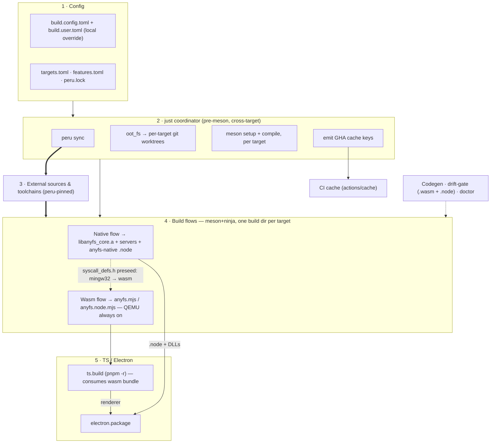
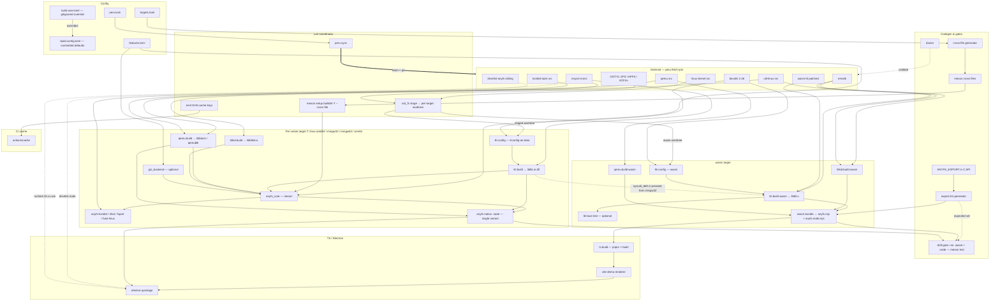
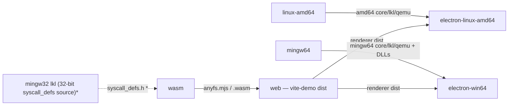

# Build System Refactor — Design

Date: 2026-05-31
Status: Approved design (first spec of a multi-step effort)

## Context

The anyfs-reader build system has grown organically across five semi-independent
layers and is now ~5,000 lines of glue that is hard to reproduce, duplicated, and
pervasively hardcoded. This document is the design for refactoring it. It is
explicitly the *beginning* of a larger effort: the phases below are intended to be
turned into separate implementation plans, landed and verified independently.

### The layers today

1. **Native C build** — `meson.build` (548 lines) + `meson_options.txt` (11
   options). Builds `anyfs_core`, `anyfs-ksmbd`, `anyfs-nfsd`, `anyfs-lspart`,
   `anyfs-fuse` (Linux) / `anyfs-winfsp` (Windows), plus three non-shipping bench
   targets. 16 `if enable_*` blocks, 11 `host_machine.system()` branches;
   `ANYFS_HAS_GIO/QEMU` threaded through ~8 arg-lists; a tangled QEMU
   shared-vs-static split (`qemu_dep` declared three times).
2. **Shell orchestration** — 14 scripts, ~4,300 lines. Key duplication:
   `gen_lkl_config.sh` (566) ↔ `gen_lkl_config_wasm.sh` (~180 lines duplicated);
   `build_lkl.sh` ↔ `build_lkl_wasm.sh` (90% shared control flow);
   `build_anyfs_wasm.sh` ↔ `build_anyfs_browser_wasm.sh` (~90% overlap, differing
   only in `ANYFS_QEMU` + ASYNCIFY). Plus `build_anyfs.sh` (537, the orchestrator),
   `build_qemu.sh`, `build_libblkid_{mingw,wasm}.sh`, `oot_fs.sh`,
   `build_boot_wasm.sh`, `mkwinfsp_implib.sh`, and three `package_*.sh`.
3. **TS / wasm / Electron** — three bundlers (tsup + Vite + esbuild), a pnpm
   monorepo, a native addon (`anyfs-native`, the `.node` module) with three build
   variants (host-node / electron-linux / electron-win64-cross), and three
   near-identical `stage-native*.sh` scripts.
4. **CI** — `linux.yml`, `mingw64.yml`, `run_action_local.sh` (via `act`). Only two
   of the build targets are in CI (no arm64 / mingw32 / wasm).
5. **Tests** — `tests/run_tests.sh`, `tests/smoke-debian-qcow2.sh`, Playwright e2e
   under `ts/tests/e2e/`.

### How the layers actually depend on each other

The TS/Electron layer is **not** purely downstream of the wasm bundle. The Electron
app has two execution modes, and packaging joins both flows plus the native C build:

```
[per native target T ∈ {linux-amd64, mingw64, mingw32, (arm64)}]
  deps → oot.stage → lkl → qemu → blkid → anyfs_core + servers (the C build)
     └─→ anyfs-native .node   (node-gyp/cross; links T's libanyfs_core.a +
                               liblkl + qemublk; one variant serves Node + Electron)

[wasm target]
  ... → wasm.bundle  →  anyfs.mjs / anyfs.wasm

[TS / Electron]
  ts.build (pnpm -r build)   ⟸ depends on wasm.bundle output (@anyfs/core)
  electron.package           ⟸ depends on ts.build (renderer)
                               + anyfs-native .node (matching platform)
                               + runtime DLLs (Windows)
                               + drivelist .node (external sibling repo)
```

The native module is a **single** `.node` shared by both the Node test harness and
Electron (the N-API ABI was confirmed compatible — no separate variant). The wasm
bundle **always** includes the QEMU block layer (there is no raw-only wasm variant),
so the `build_anyfs_wasm.sh` / `build_anyfs_browser_wasm.sh` pair collapses to one
wasm build with browser / node *output* variants only.

### Measured pain (grounded inventory)

| Category | Measured scale | Representative locations |
|---|---|---|
| Local paths (`$HOME` / `/home/kosaka` / `~`) | **117 occurrences** across `scripts/` + `ts/` | nearly every build script + `package.json` + TS staging |
| `/opt` toolchain/sysroot | **28 occurrences** | `cross-anyfs-*.txt`, `*.cmake`, `build_anyfs.sh:383`, `build_libblkid_mingw.sh:34` |
| cross-prefix / triple | **56 occurrences** + 5 cross files + 2 cmake toolchains (3 cross files are dead) | scattered across scripts |
| dependency version pins | split between CI yaml and per-script defaults | `linux.yml` `LKL_REF=lkl-6.18` / `QEMU_REF=v11.0.0` / `KSMBD_REF=master` vs `$HOME/...` defaults |
| symbol / export tables ⚠️ | ~35 `_anyfs_ts_*` symbols, each with a `_p` async twin, hand-typed and copied into **two** scripts; **no `EMSCRIPTEN_KEEPALIVE` annotation in C** | `build_anyfs_wasm.sh:192`, `build_anyfs_browser_wasm.sh:114` |
| magic defines (`ANYFS_HAS_*`, `__CYGWIN__`, `LKL_RPCBIND_GUARD`) | **41 occurrences** | scripts + meson + src |
| PE system-DLL allowlist | inline hardcoded | `build_anyfs.sh:429` |
| `.node` export names | name-based calls, no compiler check | `electron-demo/src/main.ts` |

The export-table case is the dangerous one: the `EXPORTED_FUNCTIONS` string is the
*only* source of truth for the wasm export set, it is hand-maintained in two places,
and it has no compiler-checked link to the C API. The `.node` case is the same class:
`main.ts` calls addon functions by name with no check — a session-API rename has
already silently broken all native opens until `main.ts` caught up.

### Other cross-cutting problems

- Hardcoded tool paths with no override — worst offender:
  `$HOME/linux-wasm/workspace/install/llvm/bin/wasm-ld` (Joel's patched linker).
- No single entry point / dependency manifest. Build order lives in comments and
  error messages. The wasm build silently depends on a prior mingw32 build (the
  `syscall_defs.h` preseed).
- `oot_fs.sh` mutates the shared `$LINUX_DIR` (symlinks + patches) → parallel/concurrent
  target builds are unsafe.

## Goals

All four are in scope:

1. **Reproducibility / onboarding** — a documented, parameterized flow; no `$HOME`
   or `/opt` assumptions; declared and validated tool/dependency requirements.
2. **Duplication / maintainability** — config logic and flag lists in one place.
3. **Single orchestration entry** — one driver that knows targets, prerequisites,
   and order, with a dependency graph, caching, and parallelism.
4. **Repo hygiene** — dead code deleted (broad `.gitignore` cleanup deferred — see
   non-goals).

## Non-goals (YAGNI)

- **WinFSP support is removed entirely** (decided): delete the `anyfs-winfsp` target,
  the `enable_winfsp` / `winfsp_root` options, `mkwinfsp_implib.sh`, the WinFSP cross
  files, and any WinFSP `.def` codegen. Windows ships **core + servers only**
  (matching what CI already builds). `enable_fuse` (Linux libfuse3) stays.
- **Broad `.gitignore` / working-tree hygiene is deferred** (decided — "先不管"). The
  only ignore entry added in this effort is the one required to make the local config
  override work (`build.user.toml`); see Configuration.
- Do **not** port toolchain *invocations* (make / meson-of-deps / ninja / emcc /
  emconfigure / node-gyp / QEMU configure) into a bespoke language — they stay as
  thin commands wrapped by meson `custom_target`s.
- Do **not** adopt Nix in this effort. `flake.lock` is the "true hermetic" answer and
  is recorded as a possible future; its read-only store fights the
  mutate-then-build model and is its own project.

## Architecture

**meson is the orchestration layer for the whole build, not just the C part**
(decided). The bespoke DAG/cache engine originally proposed in Python is dropped:
meson + ninja already provide the dependency graph, incremental rebuild, and
parallelism. The shell build steps and the TS build become meson targets.

| Orchestration concern | How meson does it |
|---|---|
| DAG / incremental / parallel | `custom_target()` wraps each shell step (LKL, QEMU, blkid, wasm-bundle, native `.node`) with declared inputs/outputs; ninja schedules + rebuilds |
| TS build ("just needs to build") | a `custom_target` / `run_target` runs `pnpm -r build`, declared to **depend on the wasm-bundle output** — formalizing today's implicit "wasm artifact → TS" copy |
| Native `.node` | a `custom_target` invoking node-gyp / the cross builder, depending on the target's `libanyfs_core.a` + LKL + QEMU libs; one variant serves Node + Electron |
| codegen (cross files, export lists) | `configure_file()` / a generator `custom_target` |
| tool discovery / doctor | `find_program()` / `dependency()` + a `doctor` `run_target` |
| tests | `meson test` wrapping `run_tests.sh`, `smoke-debian-qcow2.sh`, Playwright |

### The one meson limitation → a thin coordinator

meson configures **one cross target per build directory**; it cannot produce
linux-amd64 + mingw64 + wasm from a single `meson setup`. And the dependency fetch
(`peru`) plus the per-target `oot_fs` worktree staging must happen *before*
`meson setup` (the kernel tree must be staged before meson can find LKL).

So a **thin top-level coordinator** owns exactly what is outside a single meson build
dir. Chosen tool: **`just`** (a `Justfile`) — lightweight, readable, same mental model
as meson; reviewable to swap for `make`/Python. It does four things:

1. `peru sync` — fetch + pin external sources and toolchains.
2. Stage `oot_fs` into a **per-target git worktree** of the kernel tree (removes the
   shared-`$LINUX_DIR` mutation hazard).
3. Loop targets: `meson setup builddir-<T> --cross-file=<generated>` then compile.
4. Emit GHA cache keys (from `peru.lock` + hashed config/sources).

Everything *within* a target is meson+ninja. Outside it is the coordinator. What
remains of "Python" is a few small codegen helpers invoked by `custom_target`s (e.g.
the export-list generator) and the existing wasm fixers
(`wasm_fix_absolute_brackets.py`, `wasm_prefix_kernel_symbols.py`).

### Boundary principle

> **Config/data and the graph are declarative (toml + meson + features); commands
> only invoke toolchains.** The migration is a *selective* consolidation, not a
> 4,300-line rewrite: duplicated shell logic collapses into parameterized commands
> wrapped as meson targets; decisions and lists move into config and codegen.

## Dependency graph

Two views of the same graph: a **macro** view (the layers, and the two build flows
that join at Electron) and a **detail** view (artifact- and toolchain-level edges).
Edge legend: solid = produces / feeds; thick = peru fetch+pin; dotted = conditional /
cross-target / validation.

### Macro



### Detail



Notable edges to keep in mind:

- **mingw32 → wasm `syscall_defs.h` preseed** — **REMOVED** (implemented & verified):
  the wasm build now self-harvests `syscall_defs.h` from its own `vmlinux` via a WASM
  custom section, and the wasm config enables minimal NET (lo-only). No cross-target
  edge remains; wasm is self-contained. (See "syscall_defs.h — cross-target edge
  REMOVED".)
- **`electron.package` four-way join**: renderer (wasm → ts → vite) + `anyfs-native`
  `.node` + Windows runtime DLLs + `drivelist.node`. The only point where the wasm
  flow and the native flow meet.
- **wasm always includes QEMU**: no raw-only wasm variant; the `*_wasm` /
  `*_browser_wasm` script pair collapses to a single wasm build (browser / node
  *output* variants only).

## Configuration (layered, with local override)

- `build.config.toml` — committed, site-neutral defaults: dependency roots, tool
  locations, the pinned Electron version, target/feature defaults.
- `build.user.toml` — **gitignored**, machine-local overrides (the only ignore entry
  this effort adds). Replaces the scattered `$HOME` / `/opt` assumptions and the
  ad-hoc env overrides.
- `targets.toml` — one record per target (triple, cross-prefix, sysroot,
  output-format, defines, toolchain kind) → **generates** the meson cross files.
- `features.toml` — backend table (gio, qemu, ksmbd, fuse, blkid, oot-fs drivers) →
  derives `ANYFS_HAS_*` defines + source selection + meson options + export filtering.

The coordinator reads `build.config.toml` overlaid by `build.user.toml`, and
translates the relevant bits into the generated meson cross/native files so meson and
the coordinator share one source of truth.

## Single source-of-truth map (de-hardcoding pillar)

| Today (scattered) | Canonical source |
|---|---|
| 117× `$HOME`/paths, 28× `/opt` | `build.config.toml` + gitignored `build.user.toml` + `doctor` discovery (`find_program`/`pkg-config` where possible; explicit pin for `wasm-ld`; binutils comes from msys2-cross / system, not a separate build) |
| 56× triple/cross-prefix, 5 cross files, 2 cmake toolchains | `targets.toml` → **generates** meson cross files |
| 41× `ANYFS_HAS_*` and friends | `features.toml` → derives defines + sources + meson options + export filtering |
| version pins in CI yaml AND script defaults | `peru.yaml` + `peru.lock` (SHA pin) |
| 35 hand-typed wasm export symbols (×2) + `.node` export names | `ANYFS_EXPORT` annotation in C → **codegen** export tables → **drift-gate** on both `.wasm` and `.node` |

### Symbols / exports (aggressive — covers wasm AND native)

1. Annotate the C public API once (an `ANYFS_EXPORT` macro, expanding to
   `EMSCRIPTEN_KEEPALIVE` / visibility / N-API registration as appropriate).
2. **Generate** the emcc `EXPORTED_FUNCTIONS` list from the annotated symbols; `_p`
   async twins are derived mechanically (`base` + `_p`), not listed.
3. **Drift-gate** (CI + local, as a `meson test`): `nm`/`objdump` the produced
   `.wasm` **and** `.node` (and `.dll`), compare actual exports against the generated
   expected set, fail on mismatch. This closes both silent-drift bug classes (the
   wasm export list and the `.node` export-name drift).

## External dependencies — peru

Use [peru](https://github.com/buildinspace/peru) for fetch + pin + lock (decided).
It expresses heterogeneous imports (`git` source repos **and** `curl` toolchain
tarballs) uniformly, pins to a `peru.lock`, and supports per-module steps so patch
application is expressible — without subsuming the build system (unlike Yocto) or
imposing a workspace topology (unlike west / google-repo). Submodules were rejected
(huge trees, the in-place mutation model, no toolchain coverage).

- `peru.yaml` declares source repos (`linux`, `qemu`, `util-linux`, `ksmbd-tools`,
  OOT-fs drivers, the `drivelist-anyfs` sibling) and toolchains (`emsdk`,
  `msys2-cross`, `wasm-ld`).
- **No separate `binutils` dependency** (verified): the `~/binutils-gdb` 2.46 build is
  redundant. The kernel-6.13+ ≥2.30 requirement + LKL PE/COFF weak-symbol patch are
  satisfied by **msys2-cross's binutils** (`2.46.0.20260210`, already pinned) for
  mingw, and by the **system binutils** (≥2.30; the PE patch is mingw-only, not needed
  for native ELF) for linux-amd64/arm64. Confirmed by building mingw64 LKL green with
  `/opt/msys2-cross/bin/x86_64-w64-mingw32-{ld,as}`. The `BINUTILS_DIR` override
  remains (to bypass the stale 2.25.1 that `tools/lkl/bin` prepends to `PATH`) but
  becomes per-target: mingw → msys2-cross, native → system — a `gen_lkl_config.sh`
  simplification for the plan.
- **LKL is a single unified ref — no per-target override.** The kernel port is
  captured on `xdqi/lkl@lkl-anyfs` (the merge of the wasm + win64 ports on the
  `tavip/lkl-6.18` base); the target code is selected at build time by the existing
  `#ifdef __wasm__` / `_WIN64` / `arch/lkl/Makefile` platform guards. Verified to
  build wasm + linux-amd64 + mingw64 from this one branch — so peru pins **one** LKL
  ref, not two. The clean component branches `xdqi/lkl@lkl618-{wasm,win64}` are kept
  as the sources that merge into `lkl-anyfs`. (The wasm port is now independent of the
  win64 `lkl_long_t`/LLP64 work; `lkl618-wasm` builds standalone on `tavip/lkl-6.18`.)
- The patched LLVM/wasm-ld lives on `xdqi/llvm-wasm@wasm-18.1.2-anyfs` (1 commit over
  Joel's `wasm-18.1.2`).
- `peru.lock` pins every entry to a SHA/hash; branch refs (e.g. ksmbd `master`) are
  resolved to a concrete SHA at lock time — closing a current reproducibility hole.
- Upstream-pristine + `patches/<dep>/series` together fully determine each source
  tree. The coordinator applies the series into a **per-target git worktree**.
- `doctor` validates: checkout at locked SHA, patches applied, toolchain versions.

### Why not meson `wrap` instead of peru

meson 1.7's `wrap` can pin a git revision, pin a tarball hash, and apply patches —
adequate for *source repos*. It cannot replace peru because of two structural limits:

1. **Toolchain chicken-and-egg (decisive).** The cross-compilers (emsdk, msys2-cross,
   binutils 2.46, the patched LLVM) must exist *before* `meson setup` — the cross
   file names the compiler. But a wrap is only resolved *during* setup /
   `subproject()`. Setup needs the toolchain; the toolchain is fetched after setup.
   So toolchain acquisition is inherently a pre-meson step (the coordinator / peru).
2. **Per-target worktree staging.** A wrap checks a dependency out once into
   `subprojects/<name>`; `oot_fs` stages the kernel tree *differently per target*
   (wasm vs native) and concurrently. One wrap checkout cannot be staged two ways.

Using wrap would mean two fetch mechanisms (wrap for sources, coordinator for
toolchains+worktrees) — strictly worse than one peru.

### wasm-ld: pinned base + local lld patches (reproducibility landmine)

The wasm LKL link uses `LLD 18.1.2` from `joelseverin/linux-wasm` (built via
`linux-wasm.sh build-llvm`): base LLVM 18.1.2 + Joel's patches (GNU-ld linker-script
support in wasm-ld; wasm/ELF compatibility fixes). The `build_lkl_wasm.sh` wrapper
routes only the final SECTIONS{} script link to this 18.1.2 wasm-ld; everything else
uses emsdk's stock wasm-ld (currently `LLD 23.0.0`).

**On top of Joel's branch we carry three local edits** to `lld/wasm/`
(`ScriptParser.cpp`, `SyntheticSections.cpp`, `Writer.cpp`) that make `-r`
(relocatable) linking work with the LKL SECTIONS{} script: allow `--script` in `-r`
mode, ignore `OUTPUT_FORMAT/OUTPUT_ARCH/ENTRY/TARGET`, assign sequential segment
indices in `-r`, and emit script-defined symbols with no output segment as absolute.
These were previously uncommitted in a local LLVM checkout (a reproducibility
landmine — a fresh `build-llvm` would omit them and break the wasm build).

**Resolved:** the edits are now committed to a fork,
`xdqi/llvm-wasm` branch `wasm-18.1.2-anyfs` (commit `60596e2`, forked from
`joelseverin/llvm`). `peru.lock` pins that fork+branch; the toolchain build runs
`build-llvm` against it; `doctor` validates the resulting wasm-ld (18.1.x with our
`-r`/script behavior). Flag the 18.1.2-vs-23.0.0 LLD skew in the same pipeline as a
fragility to document.

### syscall_defs.h — cross-target edge REMOVED (implemented & verified)

The kernel emits each syscall's signature text into the `.syscall_defs` section via
inline `asm(.section ...; .ascii ...)`, harvested post-link with `objcopy` into
`arch/lkl/include/generated/uapi/asm/syscall_defs.h`. It carries the per-syscall
*signatures*, so it can't be reproduced by preprocessing uapi headers (an earlier
idea — wrong). It previously **preseeded from the mingw32 build**, the only
cross-target dependency.

**Solution shipped (no LLVM rebuild, no preseed):** the wasm `__SYSCALL_DEFINE_ARCH`
hook now also emits the signature text into a real **WASM custom section** via the
`.section .custom_section.syscall_defs,"",@` convention (LLVM already supports it);
`wasm-ld -r` concatenates them, and `llvm-objcopy --dump-section syscall_defs`
harvests `syscall_defs.h` straight from the wasm `vmlinux`. The build is now
self-contained.

This surfaced (and the preseed had masked) that LKL's userspace lib assumes
networking. Rather than gate every NET-dependent file for NET-off, the wasm config
now enables **minimal NET (loopback only: `NET`+`INET`, no `NETDEVICES`)** — matching
the native anyfs targets, so the socket syscalls are compiled, the self-harvested set
includes them, `net.c`/`lkl.h` compile unchanged, and `lo_ifup` works. The net core
is DCE'd from the bundle. Verified: wasm + linux-amd64 + mingw64 all build green from
the unified branch.

## CI cache integration

Designed up front to avoid two caching layers fighting.

Current CI keys per-dependency caches on `ref + hashFiles(<a few scripts>)` with a
coarse restore-key — the input set is hand-enumerated (goes stale when inputs are
added) and the key embeds a branch name that can move.

With meson+ninja as the engine:

1. **Cache the per-target meson build directories + the dependency trees.**
   `actions/cache` preserves mtimes (tar), so ninja's incremental rebuild resumes
   from a restored build dir. The expensive sub-artifacts (LKL, QEMU, blkid, wasm
   sysroot) live there or in the dep trees.
2. **Keys are content fingerprints from the coordinator**, not branch names: the
   dependency portion comes from the SHA in `peru.lock`, plus hashed
   config/features and relevant source hashes. The coordinator emits the
   `{path, key, restore-key}` set the workflow's cache steps consume — yaml no
   longer hand-writes `hashFiles(...)`.
3. **Fingerprints are machine-independent** (no absolute paths, `$HOME`, mtimes) —
   enabled by the de-hardcoding pillar and required for cross-machine cache hits.
4. **Two complementary layers.** GHA cache = cross-run persistence; ninja's own
   `.ninja_deps`/build-dir state = in-run + local incrementality — important because
   under `act` (`run_action_local.sh`) `actions/cache@v4` is a no-op, so local
   incrementality relies on the restored/created build dir.
5. **Footprint discipline.** Cache outputs, not full source trees (peru re-fetches
   shallow / uses its content cache). Scope keys per target. GHA's ~10 GB per-repo
   limit means a workflow caches only the targets it builds — relevant as
   arm64 / mingw32 / wasm enter CI.

## CI job topology

CI splits into six interdependent jobs, ordered with `needs:` and passing **products**
between jobs via `actions/upload-artifact` / `download-artifact`.



- `linux-amd64`, `mingw64`: no `needs:` (their external deps come from cache).
- `wasm`: needs a **32-bit** `syscall_defs.h`. `*` Once self-generation lands (above),
  this edge and the `mingw32` producer disappear and `wasm` becomes self-contained.
- `web`: `needs: [wasm]`. `electron-linux-amd64`: `needs: [linux-amd64, web]`.
  `electron-win64`: `needs: [mingw64, web]`.

**Artifact vs cache split.** Inter-job *products* (built libs, `.wasm` bundle,
renderer dist, packaged apps) move via **artifacts** (ephemeral per run). External
*dependency sources/builds* are restored via **cache** (`peru.lock`-keyed). The user
question — pass products between jobs via artifacts — is exactly this: products →
artifacts; deps → cache.

**Artifact layout & retention.**

- **Long-lived (14-day) artifacts** are the user-facing outputs and use a standard
  `prefix/{bin,include,lib}` layout (FHS-like) produced by `meson install --destdir`:
  `bin/` = servers + lspart + fuse; `lib/` = `libanyfs_core.a` + LKL + qemublk;
  `include/` = the **public** `ANYFS_EXPORT` headers **and the LKL-exported headers**
  (`lkl.h`, `lkl_host.h`, …) so users who link `liblkl` get a complete include set.
  (The public-vs-internal header set must be defined — the anyfs part is the same API
  surface as the export pillar; the LKL part is LKL's installed `include/` tree.)
- **Short-lived intermediates** (raw inter-job libs, the wasm bundle handed to `web`,
  `syscall_defs.h`) keep their raw layout and a short retention (≈1 day).

## Phasing

Each phase is independently shippable and CI-verifiable. Where a phase changes how
something is built, target output is compared for byte-identity (or a documented,
justified diff — generated cross files / export lists may reorder symbols) before the
old path is removed.

- **P0 — Prune, capture, config skeleton.** Delete WinFSP (target, options,
  `mkwinfsp_implib.sh`, winfsp cross files, related `src/fuse` Windows branch) and
  other dead files (`cross-win32*.txt`, `cross-win64-fuse.txt`, `package_win32.sh`,
  unused cmake toolchains once confirmed). **Capture the at-risk local lld patches**
  (the three uncommitted `lld/wasm/*.cpp` edits) into a `patches/llvm/` series before
  anything can lose them. Add `build.config.toml` + `build.user.toml` (with its single
  `.gitignore` entry). Zero behavior change to surviving targets.
- **P1 — peru + doctor.** Introduce `peru.yaml` + `peru.lock`, the coordinator's
  `peru sync`, and `doctor` (tool discovery via `find_program`/`dependency`). Scripts
  read config instead of hardcoded paths. CI fetches via `peru sync`. Gate: grep
  finds no remaining `$HOME` / `/opt` hardcoding in the build scripts.
- **P2 — meson as orchestrator + bash dedup.** Wrap the shell build steps (LKL,
  QEMU, blkid, wasm-bundle, native `.node`, TS build) as meson `custom_target`s;
  merge the duplicated script pairs and staging scripts into parameterized commands.
  The `just` coordinator loops targets and runs `meson setup`/compile per build dir.
  Verify per-target output is identical.
- **P3 — codegen + cache + tests.** Generate meson cross files from `targets.toml`;
  wire tests through `meson test`; the coordinator emits GHA cache keys (replacing the
  hand-written `hashFiles`).
- **P4 — Symbols (aggressive).** `ANYFS_EXPORT` annotation + export codegen + the
  drift-gate over `.wasm` and `.node` exports + the PE allowlist as data.
- **P5 — (optional / stretch).** Add arm64 / mingw32 / wasm to CI now that the
  coordinator makes them cheap; absorb further logic where it pays.

### Recommended first plan

P0 + P1: immediate pruning (WinFSP + dead files) plus the reproducibility foundation
(layered config + peru + doctor), without the risk of the meson-orchestration rewrite.
Everything after builds on the canonical config they establish.

## Testing & verification strategy

- Per-target artifact comparison gates each migration step that changes a build path
  (P2/P3 especially).
- `doctor` is the onboarding/reproducibility acceptance check.
- The export drift-gate (`.wasm` + `.node`) is a hard `meson test` / CI gate from P4.
- A grep-based "no hardcoded `$HOME`/`/opt`" gate lands in P1 and stays.
- Existing test runners are wrapped as `meson test` cases; behavior unchanged.

## Open items for the implementation plan

- Exact schema of `build.config.toml` / `build.user.toml` / `targets.toml` /
  `features.toml`.
- The precise `ANYFS_EXPORT` macro definition (and the N-API registration mapping for
  the native `.node`) and which translation units it lands in.
- peru module recipes for the prebuilt toolchains (how each is fetched/validated),
  including the patched LLVM (`xdqi/llvm-wasm@wasm-18.1.2-anyfs` + `build-llvm`).
- How `meson test` invokes the Electron/Playwright e2e projects (which need a built,
  staged app) vs the native/smoke tests.
- The **public** header set shipped in `include/` (vs internal headers) — defines both
  the user-facing API and the `ANYFS_EXPORT` surface.

(Resolved during this design effort — no longer open: the wasm `syscall_defs`
self-harvest, the unified `lkl-anyfs` single-ref LKL branch, and the minimal-NET wasm
config; all verified building wasm + linux-amd64 + mingw64.)
