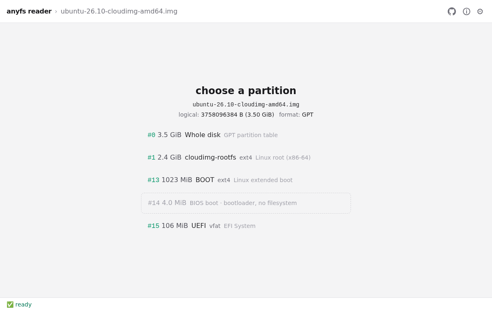

# electron-demo — the anyfs desktop app

Electron wrapper around `vite-demo`. The renderer is the same React app that `vite-demo`
deploys to the web; this package adds the Electron main process, the `anyfs://` protocol
that serves it, and the bridge to the native addon.



*The packaged Linux app with an Ubuntu 26.10 cloud image open (more screenshots in the
top-level [README](../../../README.md#desktop-app)).*

## Backends

- **native** (default): `@anyfs/native` (`anyfs_native.node`, an N-API addon) runs LKL and the
  QEMU block layer in the main process. The preload exposes it as `window.anyfsNative`; the
  renderer opens host paths, devices and URLs through it. The start screen then says
  "Native bridge active".
- **wasm** (fallback): the same wasm engine as the web app, in a Web Worker. Used when the
  addon is missing or fails to load (the main process logs `[anyfs-native] addon not
  loadable`), when `ANYFS_DISABLE_NATIVE=1` is set, or after *Settings → Disable native
  module*. Local files are read through `anyfs-url://` (main.ts streams them).

`drivelist.node` lists the computer's disks and partitions for *Open system drive…*. It is
[xdqi/drivelist-anyfs](https://github.com/xdqi/drivelist-anyfs), a fork of balena's
drivelist with partition details, checked out next to this repository
(`drivelist: file:../../../../drivelist-anyfs` in package.json) at the commit pinned in
`scripts/fetch-drivelist.sh`. esbuild bundles its JavaScript into `dist/main.cjs`;
`src/bindings-shim.cjs` points its `bindings` lookup at the staged `.node`.

## Platforms

| Package | Native addon | CI |
| ------- | ------------ | -- |
| linux x64 | built by `linux.yml` with zig at glibc 2.25 (`packages/anyfs-native/scripts/build-linux-electron.sh`); LKL, QEMU and all libraries linked statically | packaged, tested on Ubuntu 26.04 |
| windows x64 | cross-built by `mingw64.yml` (`packages/anyfs-native/scripts/build-win64.sh`, ld.lld `--delayload=node.exe`); ships with `liblkl.dll`, `libanyfs-qemublk.dll` and their DLL closure | packaged, tested on Windows Server 2025 |
| macOS arm64, x64 | cross-built by `macos.yml` with zig (`packages/anyfs-native/scripts/build-macos.sh`, [docs/macos.md](../../../docs/macos.md)); ships with `liblkl-kernel.dylib` | packaged, signed ad hoc and tested on macOS 15 (Apple silicon, Intel) |

drivelist.node is built by the same workflows (Linux: zig; Windows: mingw; macOS: node-gyp on
a macOS runner, since it links Disk Arbitration).

Electron 42 needs glibc 2.25 on Linux, Windows 10, and macOS 12.

## Development

```sh
cd ts
pnpm install

# The native addon is a gitignored build artifact. Without it the app runs on wasm.
bash packages/anyfs-native/scripts/build-linux-electron.sh  # needs the LKL/QEMU/core build trees

pnpm --filter electron-demo dev     # vite dev server + electron, live reload
pnpm --filter electron-demo start   # build vite-demo, run electron on the built renderer
```

`ELECTRON_RUN_AS_NODE` must not be set when launching the GUI (VS Code's terminal sets it);
the package scripts unset it.

## Packaging

`scripts/package.sh` turns `dist/main.cjs` (esbuild bundle, `pnpm build:main`) and
`staging/renderer/` (`pnpm stage:renderer`) into an app with electron-packager, copies a
native payload directory into `resources/native/`, writes `resources/build-info.json`, runs
`scripts/verify-package.sh`, and writes the archive plus `.sha256`:

```
out/anyfs-electron-<version>-<os>-<arch>/          unpacked app (anyfs-demo, anyfs-demo.exe)
out/anyfs-electron-<version>-linux-x64.tar.gz      Linux
out/anyfs-electron-<version>-windows-x64.zip       Windows
out/*.sha256
```

`<version>` defaults to `sha-<short commit>`; releases pass the tag. The native payload comes
from `scripts/collect-native.sh <linux|win32> <dir>` (the addon, `drivelist.node`, and on
Windows the DLL closure found by walking the import tables with
`scripts/collect-win64-dlls.sh`). Everything native lives in `resources/native/`
(`Contents/Resources/native/` on macOS); `src/native-loader.ts` resolves the addon there
and, on Windows, puts that directory on `PATH` before loading it.

For macOS, `package.sh --platform=darwin --arch=<arm64|x64> --native-dir=<dir>` stages the
addon and `liblkl-kernel.dylib` with `scripts/stage-native-macos.sh` (arch check and Mach-O
gate; needs LLVM 19 or 20 tools), adds `drivelist.node`, and writes
`<name>.unsigned.tar.gz`: electron-packager's rewrite of Info.plist breaks Electron's own
signature. On a Mac, `scripts/sign-macos.sh <name>.unsigned.tar.gz <out>` signs every native
Mach-O and the bundle ad hoc, verifies the signature, and writes `<name>.zip` + `.sha256`.

```sh
pnpm --filter electron-demo package           # Linux x64, from the local addon build
pnpm --filter electron-demo package:win       # Windows x64 (cross-builds the addon first)
pnpm --filter electron-demo package:wasm      # Linux x64 without the native addon
pnpm --filter electron-demo package:win:wasm  # Windows x64 without the native addon
pnpm --filter electron-demo package:mac:wasm  # macOS arm64 without the native addon
```

`verify-package.sh` fails a package that would silently run on wasm: the addon must be
present, of the right binary format and architecture, within the glibc 2.25 ABI floor on
Linux, and with every non-system DLL it imports next to it on Windows. It also checks the
bundled main process and the renderer with its hashed `wasm/<hash>/` fallback.

## Tests on a packaged app

```sh
# Fixture: GPT disk (BIOS boot, vfat ESP, metadata_csum ext4 with a 3 MiB payload) as qcow2
bash scripts/make-smoke-fixture.sh ~/.cache/anyfs-smoke

# Headless: open the qcow2, list partitions, mount fixroot, hash payload.bin, halt, exit
xvfb-run -a bash scripts/smoke-package.sh out/anyfs-electron-<version>-linux-x64 linux ~/.cache/anyfs-smoke

# GUI: Playwright drives the packaged executable; it must come up on the native backend
cd ../../tests/e2e
ANYFS_PACKAGED_EXE=$PWD/../../examples/electron-demo/out/anyfs-electron-<version>-linux-x64/anyfs-demo \
ANYFS_PACKAGED_FIXTURE=~/.cache/anyfs-smoke \
    xvfb-run -a npx playwright test -c packaged.config.ts
```

`smoke-package.sh` sets `ANYFS_NATIVE_SMOKE=1`, which makes `src/native-smoke.ts` run
instead of opening a window and write a JSON report; `scripts/check-smoke.mjs` compares it
with the fixture's `expected.json` (staged addon path, renderer and wasm fallback present,
partition fstypes and labels, file size and sha256, `kernelHalt` result). It then runs
`ANYFS_DRIVES_SMOKE=1`, and `scripts/check-drives.mjs` requires the staged drivelist addon to
list the host's disks with the fork's partition fields, at least one partition having a
filesystem type and a mountpoint. The GUI spec also opens *Open system drive…*.
Device tests (CI, `.github/workflows/electron.yml`): `scripts/make-device-fixture.sh` builds
the fixture; `scripts/ci/test-device.sh attach [--nbd] <parts.img> <state>` (Linux, macOS) or
`scripts/ci/test-device.ps1 attach <parts.vhdx> <parts.img> <state>` (Windows) attaches it
read-only; `scripts/smoke-device.sh <pkg> <platform> <state> <fixture> deny|allow` runs the
native smoke on the device node; `packaged/device.spec.ts` (`ANYFS_DEVICE_JSON`,
`ANYFS_DEVICE_FIXTURE`) clicks the device and its partition in *Open system drive…*;
`test-device.sh perm deny|allow` and `detach` (which checks the image is unchanged) finish.
Locally on Linux this needs passwordless sudo and touches only the loop/nbd device it creates.

`ts/tests/e2e/packaged/docs-screenshots.spec.ts` regenerates the screenshots in
`docs/screenshots/` from a packaged app and a cloud image (see its header).

## CI and releases

`.github/workflows/electron.yml` runs when `linux`, `mingw64`, `wasm` and `macos` have all
finished for a commit on `main`. It downloads their artifacts (`anyfs-native-linux-x64`,
`anyfs-native-win32-x64`, `anyfs-native-darwin-<arch>`, `drivelist-darwin-<arch>`,
`anyfs-web-dist`), packages every platform on Linux, then runs the headless and GUI smoke
tests on `ubuntu-26.04`, `windows-2025`, `macos-15` and `macos-15-intel` (signing the macOS
apps there first). Artifacts are named `anyfs-electron-sha-<commit>-<os>-<arch>`. Pushing a
`vX.Y.Z` tag on a commit that was the head of a push to `main` packages it as `X.Y.Z` and
attaches the archives and `SHA256SUMS` to the GitHub release. Nothing is signed with a
publisher identity (macOS: ad hoc only).

## Why a custom protocol

- `file://` can't carry response headers, so no COOP/COEP, no `SharedArrayBuffer`, and the
  wasm Worker's `Atomics.wait` fails.
- `file://` isn't a secure context, so `sw-download.js` can't register.
- `anyfs://` is registered as a secure, standard scheme and served by `protocol.handle()`,
  which returns real `Response`s with both headers.

## Layout

```
electron-demo/
├── src/
│   ├── main.ts            # main process: anyfs:// and anyfs-url:// protocols, IPC, native bridge
│   ├── preload.ts         # contextBridge: anyfsNative, electronDrives, dialogs, downloads, settings
│   ├── native-loader.ts   # resolves resources/native/ (packaged) or the workspace builds (dev)
│   ├── native-smoke.ts    # ANYFS_NATIVE_SMOKE=1 headless check
│   ├── bindings-shim.cjs  # replaces drivelist's `bindings` lookup in the bundle
│   └── http-proxy-worker.ts
├── scripts/               # fetch-drivelist, collect-native, package, verify-package,
│                          # stage-native-macos, sign-macos, smoke tooling
├── esbuild.main.mjs       # bundles main/preload/worker into dist/*.cjs
└── package.json
```
